# __Scope Of Work__

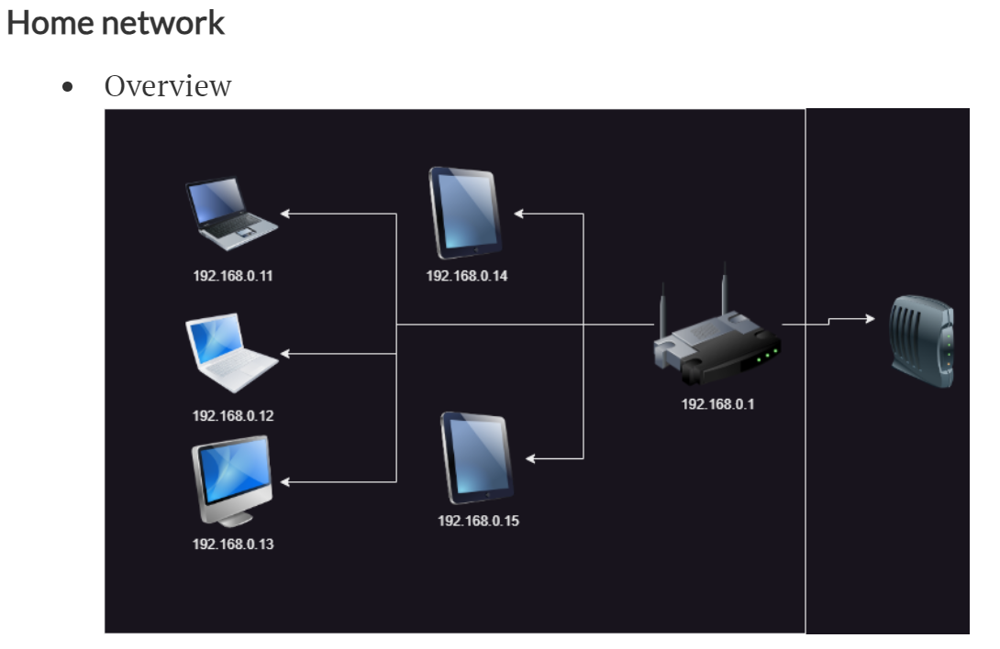

# 16-jun-2023

## 1. Concepts

* Ip address
* network id
* host id
* subnet mask
* broadcast id
* default gateway

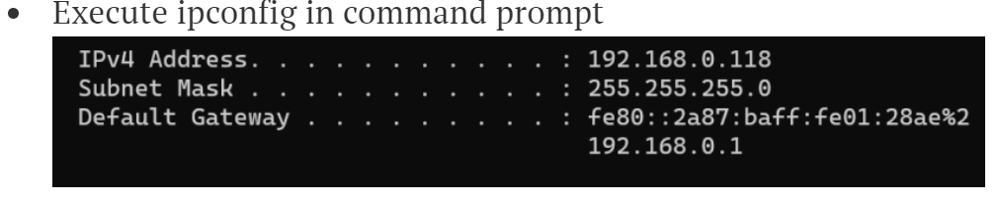
***
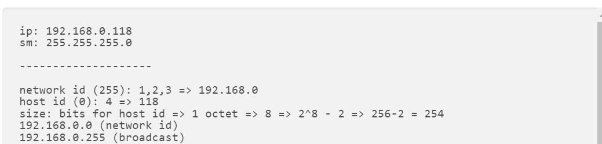

## 2. Network Principle
    * Router
    * Network

# 17-jun-2023

## 3. IP Addressing Class based

## 4. CIDR(__Classless Inter Domain Routing__)

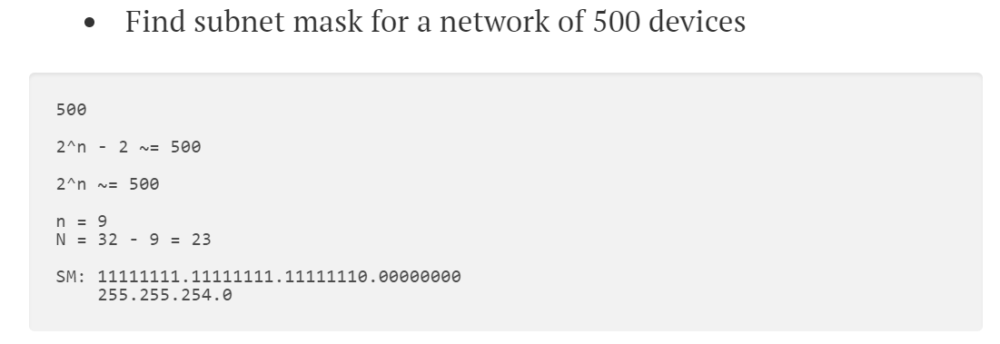

***
### __IP is expressed as  X.X.X.X/N__

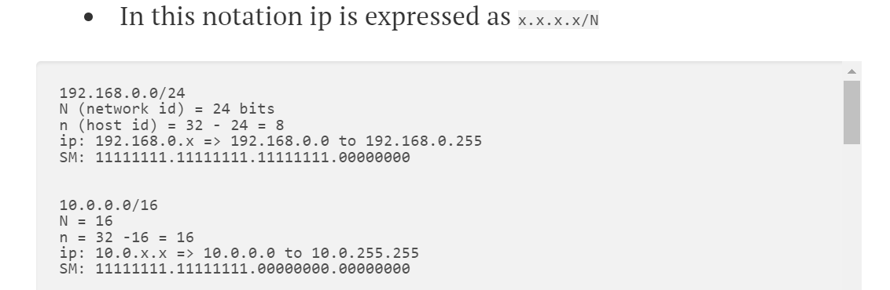

# 18-jun-2023

## 5. Priavte vs Public Network

    - Private network cidr ranges
        10.0.0.0/8: 10.0.0.0 to 10.255.255.255
        172.16.0.0/12: 172.16.0.0 to 172.31.255.255
        192.168.0.0/16: 192.168.0.0 to 192.168.255.255

## 6. Subnets
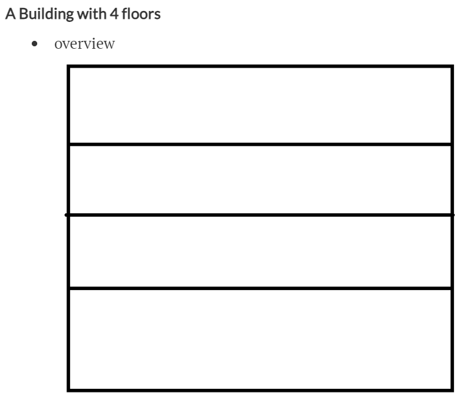

### Each floor requires 50 devices
```
each floor ~= 50
2^n ~= 50
n = 6
N = 32-6 = 26

building ~= 50 * 4 = 200
2^n ~= 200
n = 8
N = 24

10.0.0.0/8
172.16.0.0/12
192.168.0.0/16

BD SM: 11111111.11111111.11111111.00000000
FL SM: 11111111.11111111.11111111.11000000
----------------------------------------------
                                  .xx000000
                                  .00000000 => 192.168.0.0/26
                                  .01000000 => 192.168.0.64/26
                                  .10000000 => 192.168.0.128/26
                                  .11000000 => 192.168.0.192/26
```
### __Building with 8 floors__
### Each floor requires 100 devices

```
each floor ~= 100
2^n ~= 100
n = 7
N = 25

building ~= 800
2^n ~= 800
n = 10
N = 22

10.0.0.0/8
172.16.0.0/12
192.168.0.0/16

bd: 192.168.0.0/22

BD SM: 11111111.11111111.11111100.00000000
FL SM: 11111111.11111111.11111111.10000000
--------------------------------------------
                               xx.x
                               00.00000000 => 192.168.0.0/25
                               00.10000000 => 192.168.0.128/25
                               01.00000000 => 192.168.1.0/25
                               01.10000000 => 192.168.1.128/25
                               10.00000000 => 192.168.2.0/25
                               10.10000000 => 192.168.2.128/25
                               11.00000000 => 192.168.3.0/25
                               11.10000000 => 192.168.3.128/25
```

# 20-jun-2023

## 7. Network Interface

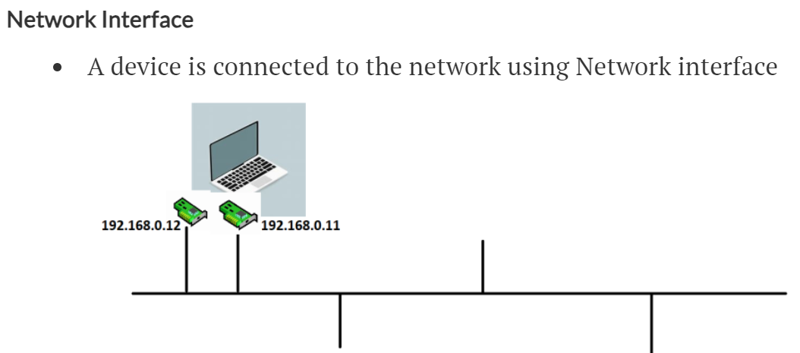

## 8. DHCP (__Dynamic Host Configuration Protocol__)

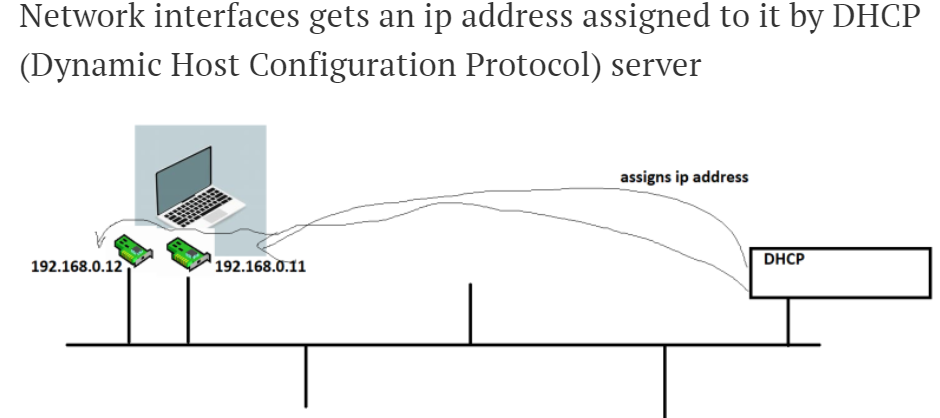

## 9. NAT (__Network Address Translation__)

__How can a private network access internet?__

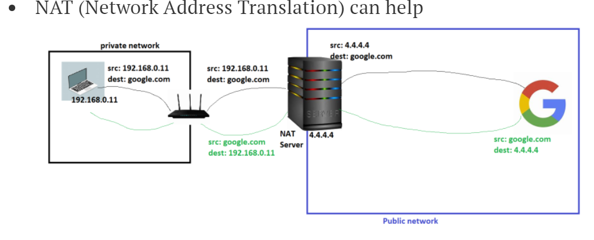

[Refer Here](https://www.geeksforgeeks.org/network-address-translation-nat/)

## 10. Rules in networking
    
    - network id’s
    - cidr ranges
    - Specific network
        192.168.0.0/24
        10.0.0.0/16

        Any ip address open to all 
        0.0.0.0/0

        specific GLOBAL ip address
        4.4.4.4/32

# 21-jun-2023

## 11. DNS (__Domain Name Server__)

[Refer Here](https://www.geeksforgeeks.org/domain-name-system-dns-in-application-layer/)

[Refere Here](https://aws.amazon.com/route53/what-is-dns/)

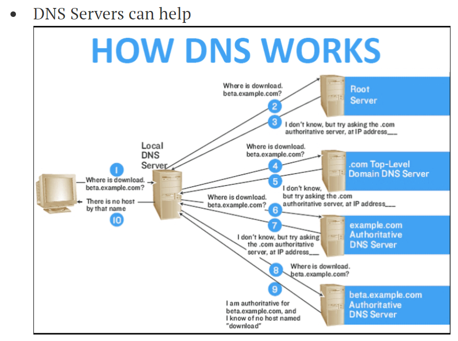

## 12. Communication between two networks privately

### __RULE1__
 - ip ranges should not collide.
 ```
 Case: non-colliding
network A: 192.168.0.0/24 => 192.168.0.0 to 192.168.0.255
network B: 192.168.1.0/24 => 192.168.1.0 to 192.168.1.255

Case: colliding
network A: 192.168.0.0/23 => 192.168.0.0 to 192.168.1.255
network B: 192.168.1.0/24 => 192.168.1.0 to 192.168.1.255
 ```

 ### __CASE 1: Within same campus/site/datacenter__
 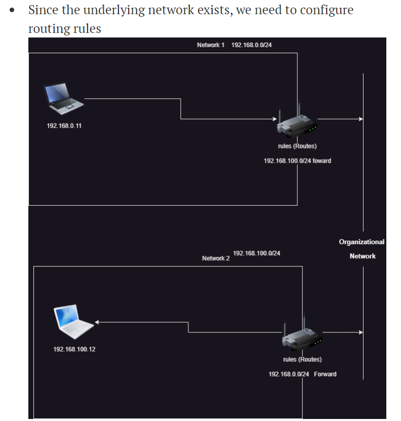

 ### __CASE 2: Across Cities__

 ### __OPTION 1: Leased Lines__

 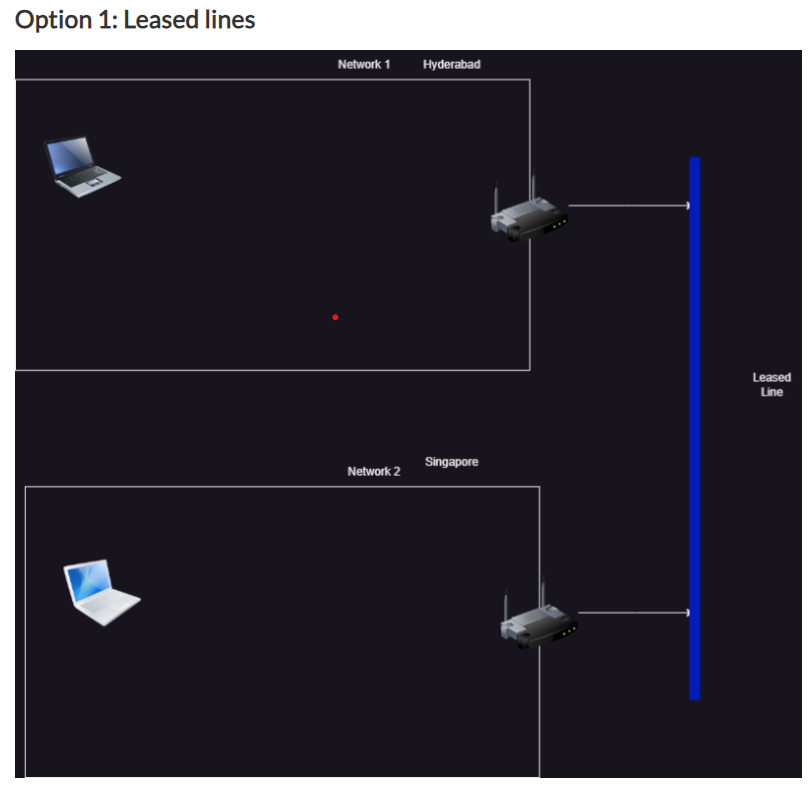

 ### __OPTION 2: VPN(Virtual Private Networks)__

 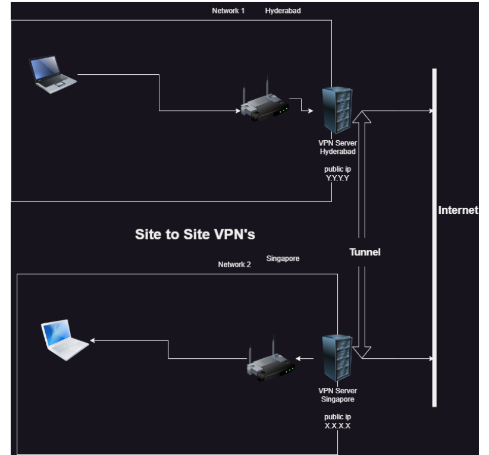

 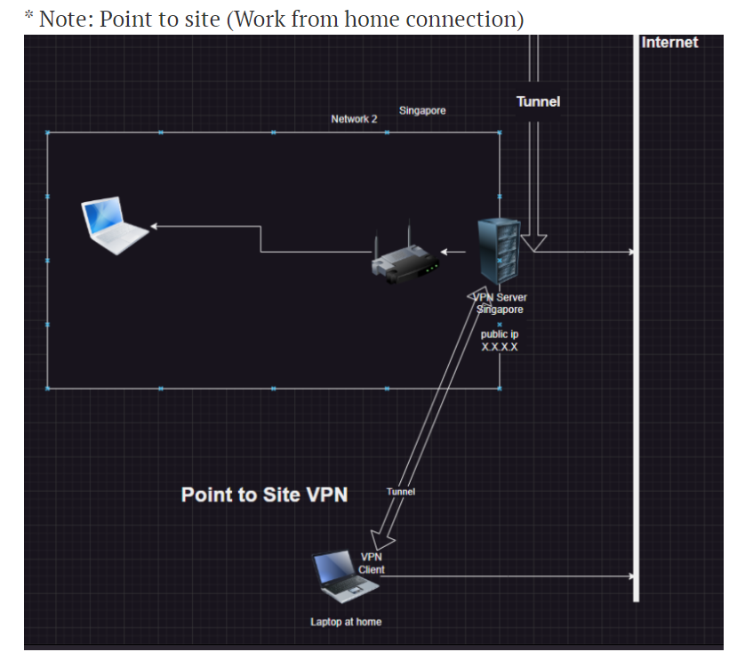

 # 23-jun-2023

 ## 13. AWS Global Infrastructure

    - Region
    - Availability Zone (AZ)
    - Data Centre (DC)
    - Local Zone
    - Edge Location: Edge Location is the Data Center used to deliver content fast to your users. It is the site that is nearest your users.

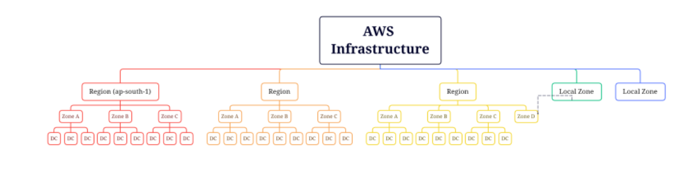

    - Mumbai
        Availability Zones: 3 | Local Zones: 2

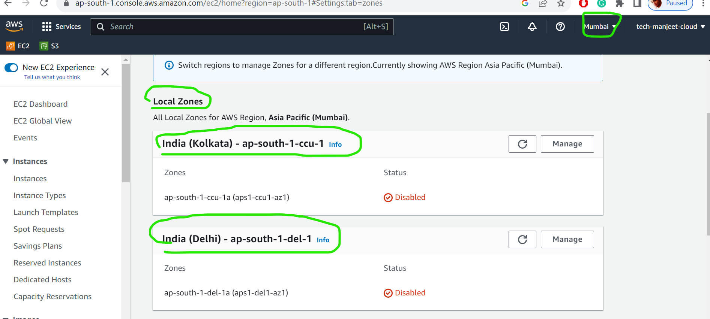
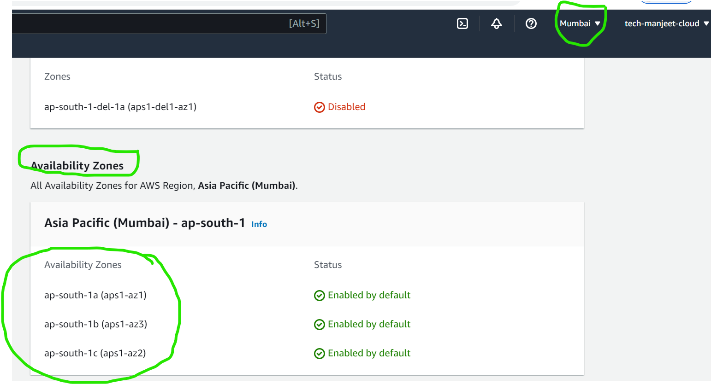

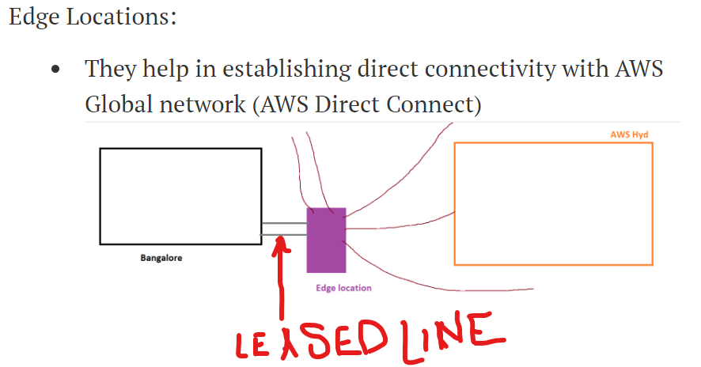


    
