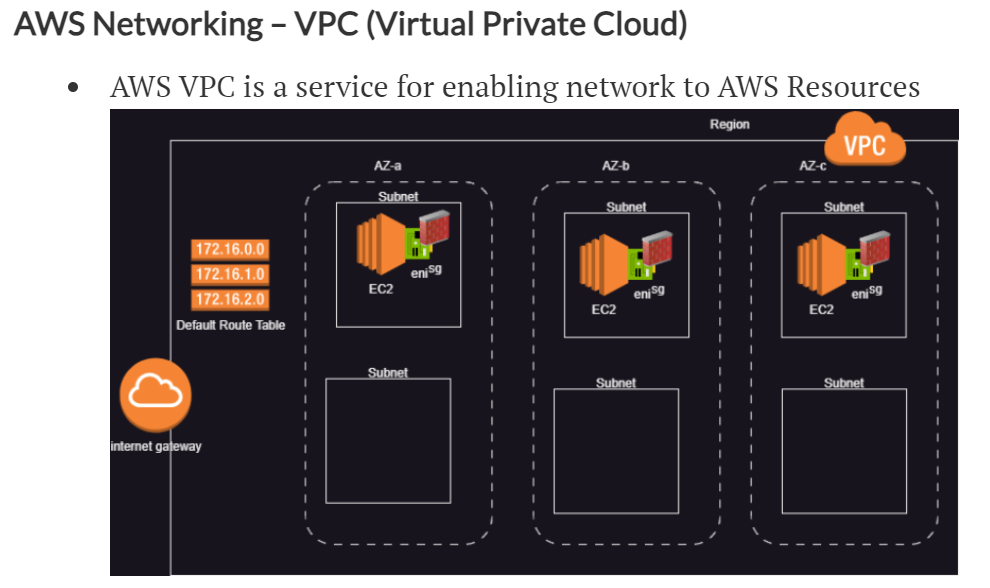

# __Scope Of Work__

 # 24-jun-2023

 ## 1. Networking Components
    - VPC  (Virtual Private Cloud)
    - Subnet
    - Elastic Network Interface
    - Security Group
    - Route Table
    - Internet Gateway

## 2. Create a vpc with 3 subnets in 3 zones

