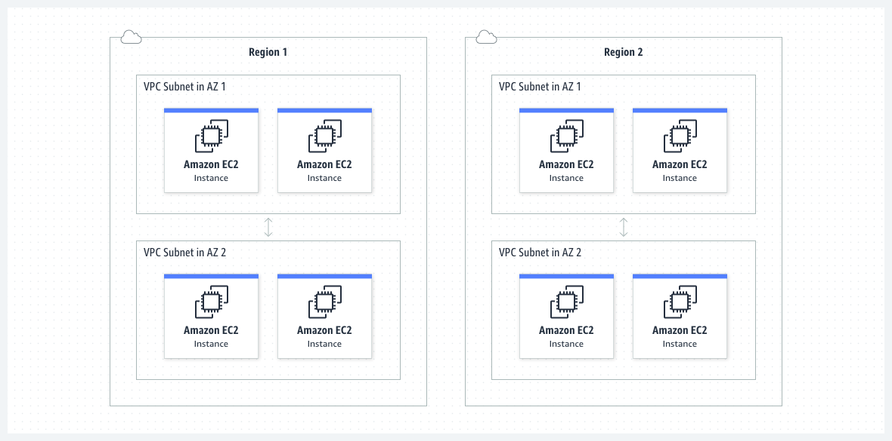

# __Scope Of Work__


 # 24-jun-2023

 ## 1. Networking Components
    - VPC  (Virtual Private Cloud)
    - Subnet
    - Elastic Network Interface
    - Security Group
    - Route Table
    - Internet Gateway
###  __VPC (Virtual Private Cloud)__



[Refer Here VPC](https://docs.aws.amazon.com/vpc/latest/userguide/what-is-amazon-vpc.html)

[Refer Here VPC Workinng](https://docs.aws.amazon.com/vpc/latest/userguide/how-it-works.html)

```
 * VPC is a service for enabling network to   AWS Resources.
 * In AWS Every Region will have a Default VPC created by AWS which has internet gateway.
 * It is a service that allows us to create and manage our own isolated network in the AWS cloud. 
 * We can launch AWS resources, such as EC2 instances, in our VPC and configure the network settings, such as IP addresses, subnets, gateways, and routing rules. 
```

### __Subnet__


[Refer Here](https://docs.aws.amazon.com/vpc/latest/userguide/configure-subnets.html)
```
* A subnet is a logical subdivision of a VPC (Virtual Private Cloud) in AWS. 
* It allows us to group and isolate our resources within a VPC, such as EC2 instances, NAT gateways, load balancers, etc.  
* Each subnet has its own IP address range and can be associated with a different availability zone within a region.
```

### __Elastic Network Interface__


[Refer Here](https://docs.aws.amazon.com/AWSEC2/latest/UserGuide/using-eni.html)

[Refer Here ENI](https://cloudpatterns.org/aws-elastic-network-interface-eni/)

[Refer Here UseCase](https://blog.opstree.com/2022/03/01/aws-elastic-network-interface/)

```
* An elastic network interface (ENI) is a virtual network interface controller/card (NIC) that is attached to an EC2 instance in a Virtual Private Cloud (VPC). 
* ENIs are used to enable network connectivity for our instances on the network. 
* They are essentially virtual network cards that you can attach to your EC2 instances. * * Having more than one of them connected to our instance allows it to communicate on two different subnets.
```
### __Security Group__


[Refer  Here aws doc](https://docs.aws.amazon.com/AWSEC2/latest/UserGuide/working-with-security-groups.html)

[Refer Here](https://aviatrix.com/learn-center/cloud-security/aws-security-groups/)

[Refer here basics](https://dzone.com/articles/aws-security-groups-basics)

```
* A security group is a virtual firewall that controls the traffic allowed to and from the resources in our virtual private cloud (VPC). 

* We can choose the ports and protocols to allow for inbound traffic and for outbound traffic. 

* For each security group, we can add separate sets of rules for inbound traffic and outbound traffic.
```

### __Route Table__


[Refer aws doc](https://docs.aws.amazon.com/vpc/latest/userguide/VPC_Route_Tables.html)

[Refer Here Stack overflow use case](https://stackoverflow.com/questions/64056712/aws-vpc-how-does-route-table-redirect-local-traffic-to-the-right-subnet-and-ins)


```
* A route table is a set of rules that determines where network traffic from our VPC or subnet is directed. 
* AWS provides different types of route tables for different purposes, such as subnet route tables, gateway route tables, transit gateway route tables, and local gateway route tables. 
* We can create custom route tables for our VPC and associate them with our subnets or gateways. * We can also enable route propagation to automatically add routes for our VPN connections or transit gateways
```

### __Internet Gateway__


## 3. Create a vpc with 3 subnets in 3 zones


